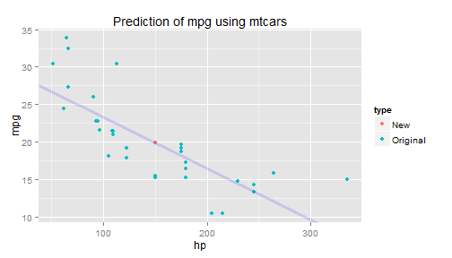

## Introduction and Inspiration

How many times have you been laying in bed wishing that you had a tool that could dynamically predict mpg from the mtcars dataset with a simple linear regression!?  Well now, you can.


--- 

## What is mtcars?

<iframe src = 'https://stat.ethz.ch/R-manual/R-devel/library/datasets/html/mtcars.html' height = '600px'></iframe>

--- 

## Plotting Mtcars

 

- Here we see that a few of the metrics appear to be correlated to MPG of the cars in the dataset.  
- Unfortunately, we don't know how well correlated the data is and we can't predict outside of the sample (yet!).


---
## Methodolgoy

- Utilizing widgets in shiny, the app allows the user to actively select the predictor from the mtcars dataset.
- Next the app fits a linear regression with the lm() function.
- Finally, the app allows the user to select an input value and predict the mpg.



```
## [1] "At 150 hp, your car will use 19.864 mpg"
```


--- .class #id 

## Link to Project


<iframe src = 'https://cjstev.shinyapps.io/ShinyProject/' height = '600px'></iframe>

